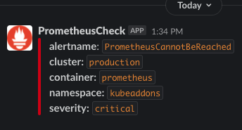

# Prometheus Up Checker
Ever wonder why alerts are all of a sudden so quiet? Is it because you are just a really awesome engineer? I'm sure you are awesome, but, being honest with ourselves here, likely this is because your monitoring system is down. Prometheus Up Checker is used to monitor your Prometheus service. Who is watching the watcher? A little something to monitor your monitoring system.

Simple python loop that continuously checks the `/-/ready` endpoint of Prometheus to see if it is available or if it returns that it is Ready. The script will run a check at the specified `CHECK_INTERVAL` and if a failure is detected in the specified `ALERT_THRESHOLD` a message will be sent to Slack to notify the user to check on Prometheus. Once the message is sent the script will then pause for the specified `ALERT_SENT_PAUSE_INTERVAL` so that alerts will continue to be sent until it is resolved but not so much that it floods your alerting platform.

There is a number of [environment variables](https://github.com/geekbass/prom-check#environment-variables) with defaults if not specified. This gives greater flexibility so that this can be run either within Kubernetes, in Docker or standalone python script.

Currently, there is only support for alerting via Slack but there are plans to support other alerting/notification platforms as well such as PagerDuty.

### Prereqs
- Python 3.9+
- Docker
- Helm

Check Quay repo for [latest tag](https://quay.io/repository/geekbass/prom-check).

### Usage
Please see examples below but as mentioned this can be run as standalone python, in Docker or deployed to Kubernetes. 

For standalone start by creating your python virtual env and then run the script after exporting your variables.
```
python3.9 -m venv venv
source venv/bin/activate
pip3 install -r requirements.txt
export PROMETHEUS_REQUEST_URL=prometheus:9090/-/ready
export SLACK_WEBHOOK_URL="https://hooks.slack.com/services/BLAH/BLAHBLAH/SOMETEXT"
export SLACK_CHANNEL="alerts"
python3.9 main.py
```

For Docker pass in the env variables via `-e`.
```
docker run -d -e "PROMETHEUS_REQUEST_URL=prometheus:9090/-/ready" -e  "SLACK_WEBHOOK_URL=https://hooks.slack.com/services/BLAH/BLAHBLAH/SOMETEXT" -e "SLACK_CHANNEL=alerts" python-test:latest
```

For Kubernetes use Helm.

`Coming soon.`

### Environment Variables

| Variable |  Description                                   |  Default |
|----------|-----------------------------------------------------------------------------------|------|
| `SLACK_WEBHOOK_URL` | The full URL of your created webhook slack app. | None. Currently required. |
| `SLACK_CHANNEL` | The channel in which to post an alert. |   None. Currently required. |
| `ALERT_THRESHOLD` | Number of times for the check to fail consecutively before alerting.  | 5 |
| `CHECK_INTERVAL` | How often to check to see if Prometheus is available.  | 30 (seconds) |
| `ALERT_SENT_PAUSE_INTERVAL` |    Period of time after an alert has been sent before starting checks again. This is to prevent flooding alerts.   |   900 (seconds) |
| `CLUSTER_NAME` | Label to specify which Prometheus is down. TIP: Use the full URL of your clusters UI so you can open it directly from alert. |    "Production" |
| `CONTAINER_NAME` | Name of the prometheus container. |    "prometheus" |
| `PROMETHEUS_SERVICE_NAME` | [Kubernetes] If Prometheus is using a service in Kubernetes this is the name of the service. |    "prometheus-kubeaddons-prom-prometheus" |
| `PROMETHEUS_SERVICE_NS` | [Kubernetes] Namespace if used in Kubernetes. |    "kubeaddons" |
| `PROMETHEUS_SERVICE_DOMAIN` | [Kubernetes] The domain being used in Kubernetes. |    "cluster.local" |
| `PROMETHEUS_SERVICE_PORT` | Port that ready endpoint is using. |    9090 |
| `PROMETHEUS_SERVICE_PROTOCOL` | Protocol being using for ready endpoint (http or https). |    "http" |
| `PROMETHEUS_REQUEST_URL` | The Full URL of the ready endpoint. Merges all of the above `PROMETHEUS_SERVICE_*` variables. Use this for the full URL of your Prometheus's Ready endpoint if you are NOT using Kubernetes or would like to bypass all other `PROMETHEUS_SERVICE_*` variables.  |    "http://prometheus-kubeaddons-prom-prometheus.kubeaddons.svc.cluster.local:9090/-/ready" |

### Built-In Healthcheck
For monitoring this service there is a built-in web endpoint healthcheck endpoint that can be found run at `0.0.0.0:5000/healthz`. If it is healthy, it will return `OK`. 

```
> curl http://0.0.0.0:5000/healthz
OK
```

### Building Docker Image

```
docker build -t prom-check:$TAG .
```

### Slack
The slack alerting function is simply just a post to your [slack webhook URL](https://api.slack.com/messaging/webhooks) that must be created prior to use. We use the [`chat.postMessage`](https://api.slack.com/methods/chat.postMessage) function to create a Slack alert to a desired channel. The message will appear as below. The ability to define your own template will become a feature at some point.



### Deploying to Kubernetes
`Coming Soon`

### Try it out

### To Do:
- [ ] Error Handling
- [ ] Add additional Alerting Platforms
- [ ] helm chart
- [ ] Docs
- [ ] Allow for user to pass own Template data for Slack message
- [ ] Tests
- [ ] Build out some automation: docker builds, linting, etc...
- [ ] Add resolved Message to Slack?

